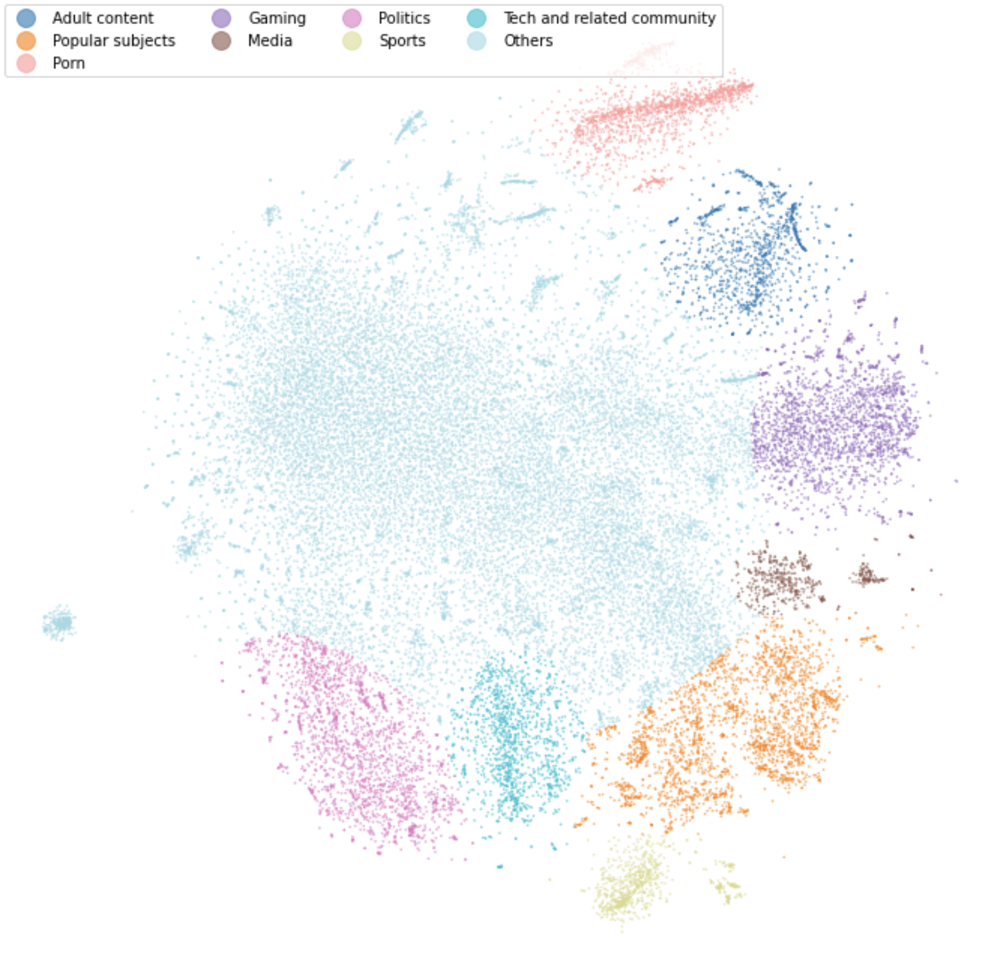

# A journey into the Reddit network - Hyperlink formation -

## Abstract

The goal of the project is to explore the Reddit hyperlink network and in particular to assess if the balance and the status theories can be applied for this dataset.
Also, we examine if the network exhibit locally the same behaviour as the whole network. We will use the embedding vectors of the subreddits to group them into clusters, and check if the balance theory prevails over the status one inside these clusters. Also, the dominant theory might be cluster dependent.
One final important aspect is the temporal dimension of the network.
We propose to analyse the evolution of the network using the balance and status theories, which might reveal structural changes as the network grows (the addition of new edges or the modification of the sign of a previous one).

  

## Research Questions

The goal of this project is to reveal what is the underlying structure of the network:

* How hyperlinks are created between subreddits ?
* Can we characterise them using an existing social theory ? In particular, do the status and balance theories apply to the proposed dataset (the Reddit hyperlink network) ? If not, why ?
* Are the results the same at all scale (i.e. when a single specific community is considered) ?
* Does the network exhibit structural changes through time ?

We present here some results on how these topics relate to each other, both on a large scale and on a smaller scale. Finally we explore the evolution of the network through time.

## Proposed dataset

We propose to use the reddit dataset (which can be found here: https://snap.stanford.edu/data/soc-RedditHyperlinks.html). This dataset contains the hyperlink network representing the connection between subreddits, from January 2014 to April 2017. The nodes are represented by the different subreddits, and each edge corresponds to the hyperlink between subreddits appearing in each post. 
Therefore an edge might appear several times and we need to figure out how to assign a timestamp to each one of them. If we double-count the edges that appears multiple times, there are a total of 67180 nodes, and 858488 edges. The network is directed and signed. The latter were obtained through sentimental analysis, and takes value in {-1,+1}. 
Also, the graph has a temporal dimension that keeps track of the date at which each hyperlink was created.
Another complementary dataset of the reddit hyperlink network can be found at http://snap.stanford.edu/data/web-RedditEmbeddings.html. It gives the embedding vectors for each subreddit. The embedding vectors are of size 300, and there is a total of 51278 vectors (so we might exclude some subreddit in the analysis).

## Methods
- *Whole dataset analysis: balance versus status theory.* We performed similar analysis as described in the Signed Network paper. In particular, each configuration for the directed triads were counted and the proportions were compared to what predict the two theories. We needed to implement an algorithm to find these proportions that takes into account the timestamps. For the case where the triad census did not work, we explained what characteristic of the dataset can cause this issue, and constructed an new approach that balance this issue. We also used a logistic regression that can incorporate both theories in the same analysis.
- *Clustering the dataset:* Using the embeddings, our goal was to form clusters of subreddits that share common characteristics. As the dataset is large, this was not feasible manually, and had to be done computationally. One particular problem was the dimension of the embedding, which was quite large. As such, we used t-SNE algorithm to reduce its dimension to 2, and then used a gaussian mixture model to get the clusters. The choice for the number of clusters was determined visually and by checking the subreddit names, as the graph still has a large cluster in the middle with mixed subreddits.
- *Temporal analysis*: as the networks evolves through time, we analysed the relative proportions of each type of triads for each network given at some point in time, from 2014 to 2017. This turned out not to be conclusive, and so decided to check the trend (and if it was significative) of the negative proportion of negative edges for each identified clusters, using a linear regression. Eventually, we also defined and analysed periods of _conflicts_ in the clusters of the network, and used visual plots to see if these conflicts were caused by subreddits with high number of incoming hyperlinks (ie. popular subreddits). 

## Proposed timeline

### First Week
- Load and filter the datasets,
- Build status and balance triad count algorithm,
- Reproduce status and balance table.

### Second week
- Temporal analysis,
- Clustering analysis.

### Third week
- Clustering analysis, 
- Write data story,
- Comment code.

### Fourth week
- Video pitch.

## Organization within the team

- Alessandro: algorithm conception and implementation, temporal analysis, video pitch slides.

- Antoine: exploratory analysis, running tests, tables and interpretation, temporal analysis, video pitch slides.

- Youssef: data story, clustering analysis, interpretation, video pitch.

### Nota Bene

You will find pre-computed datasets in the [Google drive](https://drive.google.com/drive/folders/1uuguQWxG2Ks8sy-hwCxebEWnP5TehhJw?usp=sharing).
